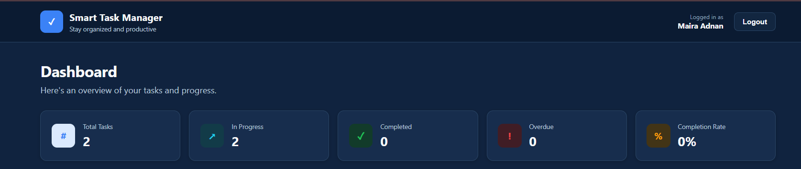
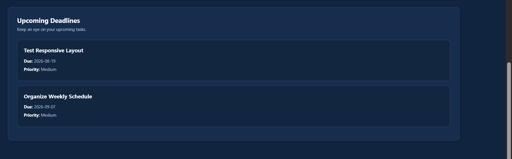

# Smart Task Management System

A modern full-stack task management application designed to help users organize their work, track task progress, and manage daily activities efficiently.

The system provides secure user authentication, task management, progress tracking, dashboard statistics, search and filtering, and database storage through a Flask backend and SQL Server database.

---

## 📌 Project Overview

The **Smart Task Management System** was developed as a full-stack software development project.

It allows users to:

* Create an account and log in securely
* Create and manage personal tasks
* Set task categories and priorities
* Add descriptions and due dates
* Track task progress
* Add progress updates/notes
* Mark tasks as completed
* Edit and delete tasks
* Search and filter tasks
* View dashboard statistics
* Monitor upcoming deadlines

The application uses a frontend interface connected to a RESTful Flask backend and SQL Server database.

---

## ✨ Features

### 🔐 User Authentication

* User registration
* User login
* Password hashing
* Session-based authentication
* Current-user verification
* Logout functionality
* Duplicate email protection
* Password validation

### 📋 Task Management

Users can:

* Add new tasks
* View their tasks
* Update task information
* Delete tasks
* Mark tasks as completed
* Set task priority
* Assign task categories
* Add task descriptions
* Set due dates

### 📊 Progress Tracking

Each task supports progress tracking.

Users can:

* Set task status
* Set progress percentage
* Add progress notes
* Update progress as work is completed
* Mark tasks as completed

Example:

```text
Status: In Progress
Progress: 70%
Progress Update:
Backend integration has been completed.
Frontend testing is remaining.
```

### 📈 Dashboard

The dashboard displays:

* Total Tasks
* Completed Tasks
* Pending Tasks
* Overdue Tasks
* Completion Percentage

### 🔎 Search & Filters

Tasks can be filtered by:

* Search keyword
* Status
* Priority
* Category

### 📅 Upcoming Deadlines

The system displays upcoming task deadlines so users can easily identify tasks that need attention.

### 📱 Responsive Design

The frontend is designed to work across:

* Desktop
* Laptop
* Tablet
* Mobile devices

---

## 🛠️ Technologies Used

### Frontend

* HTML5
* CSS3
* JavaScript
* Responsive Web Design

### Backend

* Python
* Flask
* Flask-CORS
* REST API

### Database

* Microsoft SQL Server
* PyODBC

### Development Tools

* PyCharm
* SQL Server Management Studio
* GitHub
* Web Browser

---

## 🏗️ Project Architecture

```text
User
 │
 ▼
Frontend
HTML + CSS + JavaScript
 │
 │ HTTP Requests
 ▼
Flask REST API
 │
 │ Database Queries
 ▼
SQL Server Database
```

---

## 📂 Project Structure

```text
Smart-Task-Management-System/
│
├── Backend/
│   ├── App.py
│   ├── auth.py
│   └── db.py
│
├── Frontend/
│   ├── index.html
│   ├── style.css
│   └── script.js
│
├── Database/
│   └── database.sql
│
├── screenshots/
│   ├── login.png
│   ├── register.png
│   ├── dashboard.png
│   ├── add-task.png
│   ├── progress-update.png
│   └── completed-task.png
│
└── README.md
```

> Keep the folder and file names consistent with your actual project structure.

---

## 🔌 API Endpoints

### Authentication

| Method | Endpoint        | Description                |
| ------ | --------------- | -------------------------- |
| POST   | `/api/register` | Register a new user        |
| POST   | `/api/login`    | Login user                 |
| GET    | `/api/me`       | Get current logged-in user |
| POST   | `/api/logout`   | Logout user                |

### Task Management

| Method | Endpoint                        | Description            |
| ------ | ------------------------------- | ---------------------- |
| POST   | `/api/tasks`                    | Add a new task         |
| GET    | `/api/tasks`                    | Get user's tasks       |
| PUT    | `/api/tasks/<task_id>`          | Update a task          |
| DELETE | `/api/tasks/<task_id>`          | Delete a task          |
| PUT    | `/api/tasks/<task_id>/complete` | Mark task as completed |

### Dashboard

| Method | Endpoint         | Description         |
| ------ | ---------------- | ------------------- |
| GET    | `/api/dashboard` | Get task statistics |

---

## 🗄️ Database

The application uses **Microsoft SQL Server** for persistent data storage.

The main tables include:

### Users

Stores registered user information.

```text
UserID
FullName
Email
PasswordHash
CreatedAt
```

### Tasks

Stores user task information.

```text
TaskID
UserID
Title
Description
Category
Priority
DueDate
Status
CreatedAt
UpdatedAt
```

Each task is associated with a user through `UserID`.

---

## ⚙️ Installation & Setup

### 1. Clone the Repository

```bash
git clone YOUR_GITHUB_REPOSITORY_URL
```

Then open the project folder.

### 2. Create a Virtual Environment

```bash
python -m venv .venv
```

Activate it on Windows:

```bash
.venv\Scripts\activate
```

### 3. Install Required Packages

```bash
pip install flask flask-cors pyodbc werkzeug
```

### 4. Configure SQL Server

Make sure SQL Server is installed and running.

Create the required database and tables using the SQL script provided in the `Database` folder.

Update the database connection settings in:

```text
Backend/db.py
```

according to your SQL Server configuration.

### 5. Start the Backend

Open the Backend folder and run:

```bash
python App.py
```

The Flask API should run on:

```text
http://127.0.0.1:5000
```

### 6. Start the Frontend

Open the Frontend folder and run:

```bash
python -m http.server 5500
```

Then open:

```text
http://127.0.0.1:5500
```

---

## 🧪 Testing

The application was tested for the following functionality:

* User registration
* User login
* User logout
* Task creation
* Task retrieval
* Task update
* Task deletion
* Progress updates
* Task completion
* Dashboard statistics
* Search and filtering
* Database connectivity
* Responsive interface

---

## 📸 Screenshots

### Login


### Registration


### Dashboard



### Add Task

 

### Deadlines




---

## 🔒 Security

The application includes basic security practices such as:

* Password hashing
* Session-based authentication
* User-specific task access
* Input validation
* Protected task endpoints
* Duplicate email checking
* HTML escaping on frontend task content

---

## 🎯 Project Objectives

The main objectives of this project were to:

1. Develop a functional full-stack web application.
2. Connect a frontend application with a Flask REST API.
3. Implement user authentication.
4. Store application data in a relational database.
5. Implement complete CRUD operations.
6. Provide task progress tracking.
7. Create a responsive and user-friendly interface.
8. Practice API testing and database integration.

---

## 🚀 Future Improvements

Possible future improvements include:

* Email notifications for upcoming deadlines
* Calendar integration
* Dark/light theme switching
* Task reminders
* Drag-and-drop task organization
* Advanced analytics and charts
* User profile management
* Cloud deployment
* Role-based access control

---

## 👩‍💻 Developed By

**Maira Adnan**

Information Technology Student

### Project

**Smart Task Management System**

Developed as part of the **NexaSecure Software Development Internship Program  : Full Stack Mini Project**.

---

## 📄 License

This project was developed for educational and internship purposes.
